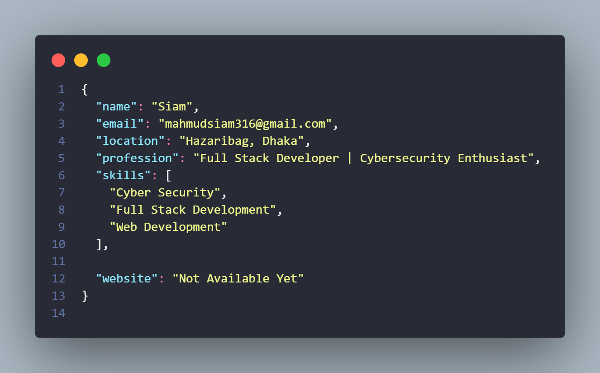

  

<h1 align="center">👨‍💻 Siam Mahmud</h1>
<h3 align="center">⚡ AKA Mr. 3xploiter ⚡</h3>

  <b>Cyber Security Researcher | Ethical Hacker | Full-Stack Engineer</b>

  
  
  

  
  
  

  <i>"Let the code speak louder than words."</i>

---

## 🧠 About Me

💀 I’m **Siam Mahmud**, a relentless **young hacker from Bangladesh 🇧🇩**  
Obsessed with **Cybersecurity**, **Ethical Hacking**, **AI Bots**, and **Modern Web Apps**.

I live where **code meets chaos** — breaking systems to understand them,  
then rebuilding them **stronger, smarter, and deadlier**. ⚔️

- 🎯 Mission: **Secure the digital world**
- 🧠 Mindset: **Think like an attacker, build like an engineer**
- ⚙️ Currently Grinding: **Pentesting • AI Agents • Convex Apps**

---

## 🔥 Tech Stack & Weapons

### 💻 Operating Systems

---

### 🌐 Programming Languages

---

### 🎨 Frontend

---

### 🧩 Backend & Databases

---

### 🤖 AI / ML

---

### 🔐 Cyber Security Arsenal

**Skills:** Recon • XSS • SQLi • Payload Development • OSINT • Pentesting

---

## 🚀 Projects

🧠 **Quba AI** – Smart AI assistant  
🤖 **Oris AI** – Advanced conversational bot  
🎨 **Wobble** – Experimental creative tech  
🏴‍☠️ **Siam's Technology** – Innovation hub

---

## 📊 GitHub Stats

  

  

---

  <b>⚠️ Think Smart. Hack Ethical. Build Powerful. ⚠️</b>

